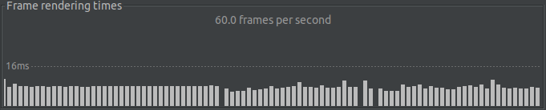
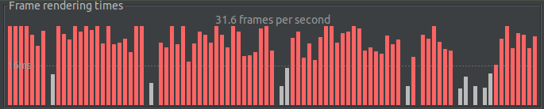

# Ads Plugin Performance

Sample app to showcase the performance problems in the [google_mobile_ads](https://pub.dev/packages/google_mobile_ads) plugin.

The app is configured to show ads but you will need to add your AdMob app ID and your ad unit id.

## Performance difference

The tests were executed in a Samsung Galaxy A3 (2017)

- Scrolling the list without the banner ad

- Scrolling the list with the banner ad

